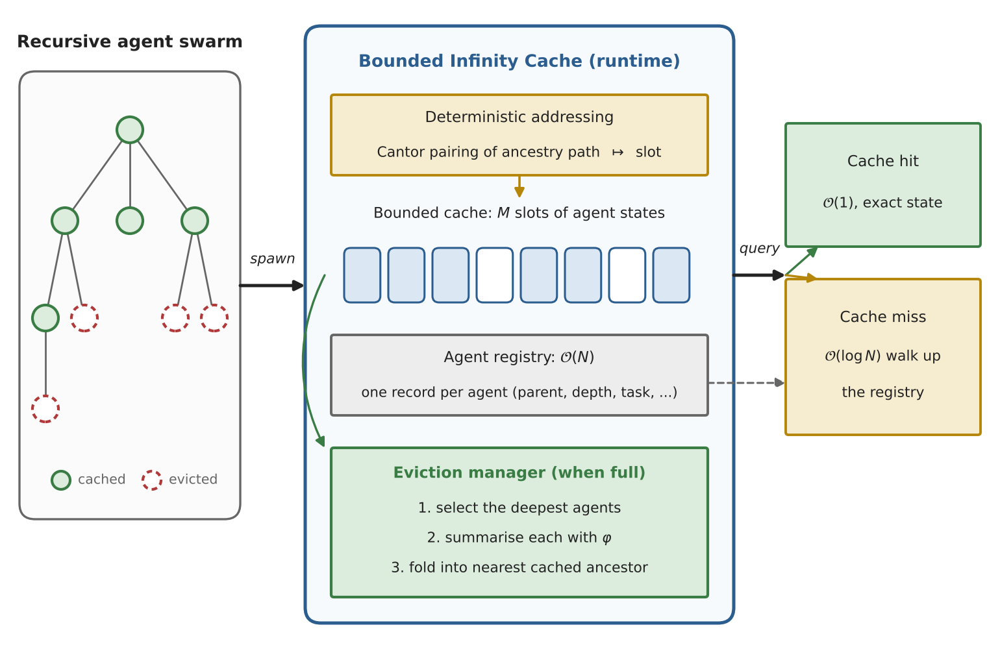
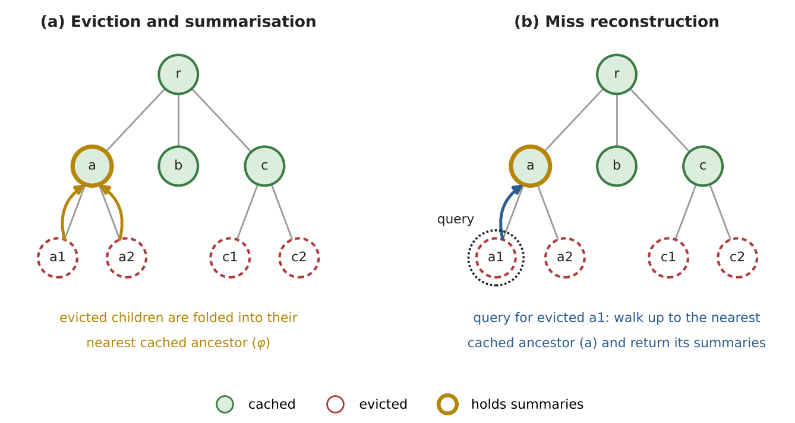
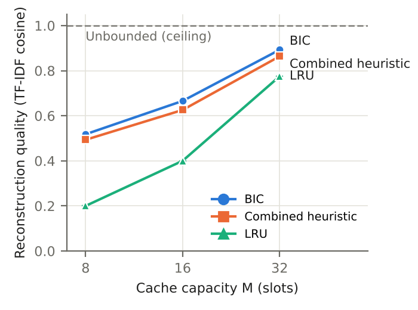
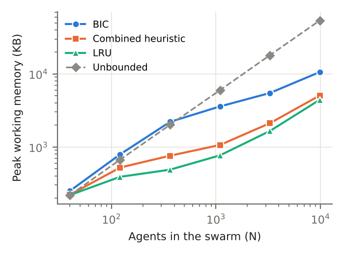

# BoundedInfinity

[](https://doi.org/10.5281/zenodo.23205752)

**A fixed-capacity cache for the working state of recursive multi-agent LLM systems.**

<p align="center">
  
</p>

## Problem

When agents recursively spawn sub-agents to solve sub-tasks, the swarm's state
grows with every agent. Current frameworks keep all of it in memory, so long runs
eventually exhaust memory or must be truncated by hand.

## Approach

The **Bounded Infinity Cache (BIC)** holds at most *M* agent states:

- **Deepest-first eviction** keeps the upper levels of the agent tree resident.
- **Hierarchical summarization** folds each evicted agent into its nearest cached
  ancestor, so its content can be recovered later.
- **Ancestor-walk retrieval** answers a query for an evicted agent by walking up the
  tree (through a lightweight registry) to the nearest cached ancestor.
- **Deterministic addressing** places each agent at a slot derived from its ancestry
  path via Cantor pairing, so placement is reproducible across runs.

<p align="center">
  
</p>

## Results

On a 40-agent research-decomposition swarm driven by GPT-5.4 (five seeds), BIC
answers every query while LRU answers 19-74% of them, and BIC is slightly ahead of a
strengthened heuristic baseline (LRU + summarization + ancestor folding + pinning) at
every cache size.

<p align="center">
  
  
</p>

Working memory stays far below an unbounded store as the swarm grows (right). The cache
itself is bounded; a per-agent registry (about 0.5-0.7 KB per agent) grows linearly, so
BIC bounds *working state*, not total memory.

## Guarantees

Proved in the accompanying paper, under the assumptions stated there:

1. **Bounded cache** - at most *M* cached states, independent of the number of agents
2. **Zero fragmentation** - occupied slots are contiguous after compaction
3. **Retrievability** - O(1) for cached agents; O(log N) ancestor walk for evicted
   agents that have a cached ancestor
4. **Liveness** - every operation terminates and the cache never blocks a new agent

## Quick Start

```bash
pip install -e ".[dev]"
pytest
```

```python
from bounded_infinity import BoundedInfinityRuntime

runtime = BoundedInfinityRuntime(cache_size=1024)
root = runtime.spawn(parent_id=None, task={"goal": "research topic X"})
result = runtime.execute(root)
```

## Project Structure

```
src/bounded_infinity/
├── cantor_pairing.py    # Generalized Cantor pairing/unpairing
├── hilbert_curve.py     # Hilbert curve state compression
├── bounded_cache.py     # Fixed-size state cache
├── eviction.py          # Hierarchical summarization eviction
├── agent_registry.py    # Agent ID → cache slot addressing
├── runtime.py           # Main BoundedInfinity orchestrator
└── adapters/            # LLM client (Gemini, OpenAI-compatible, Anthropic) used by the experiments
tests/                   # Unit + property-based tests
benchmarks/              # Performance benchmarks
docs/                    # Paper and technical report
experiments/             # Baselines, harness, experiment drivers, results
```

## Reproducing the paper's results

All numbers in the manuscript come from the result logs in this repository.

```bash
pip install -e . scipy scikit-learn matplotlib
python experiments/extract_round2_numbers.py   # every number used in the paper
python experiments/make_round2_figures.py      # figures, written to figures/round2/
```

- `experiments/results/round2/`: GPT-5.4 runs (sweep, single-enhancement baselines,
  Cantor-vs-hash ablation, access order, coding pilot), one JSON record per run including
  each agent's original and reconstructed text. Records produced before an evaluation
  error was corrected are kept in `superseded_stale_flag/` (see its README).
- `experiments/results/synthetic_fixed/`: synthetic capacity sweep, ablation, stress test
  and memory-vs-N runs (see its README).

To re-run the GPT-5.4 experiments, set `OPENAI_API_KEY`, `OPENAI_BASE_URL` and
`GPT_MODEL` in a private shell file and run `GPT_ENV_FILE=<file> sh
experiments/launch_round2.sh all` (resumable; `status` shows progress). The synthetic
experiments need no API access: `python -m experiments.run_experiments` and
`python -m experiments.run_memory_scaling`.

## License

Apache-2.0
